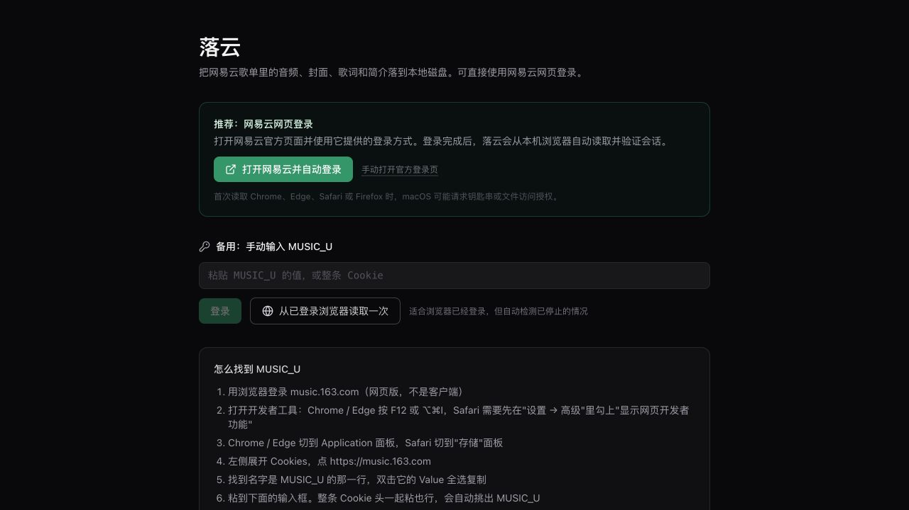

<div align="center">

# 落云 Luoyun

将网易云音乐歌单中的音频、封面、歌词和曲目信息备份到本地。

[](./LICENSE)
[](https://nodejs.org/)
[](https://react.dev/)
[](https://vite.dev/)

本地运行 · 自动网页登录 · 批量选择 · 实时进度 · 断点友好

</div>

> [!IMPORTANT]
> 本项目仅用于备份你有权访问的个人歌单。音频内容仍受版权及网易云音乐服务条款约束，请勿传播、出售或用于侵权用途。

## 界面预览

### 网易云网页登录

点击按钮打开网易云官方登录页。登录完成后，落云会在本机自动检测并验证会话，不需要手动复制 Cookie。



### 歌单选择

登录后可以浏览自己创建或收藏的歌单，再进入歌单搜索、勾选并开始备份。下图使用演示数据，不包含真实账号信息。


## 功能

- 批量备份网易云歌单中的音频、封面、原文歌词、翻译歌词、罗马音歌词和曲目信息。
- 使用网易云官方网页完成登录，支持从 Chrome、Edge、Firefox 和 Safari 自动读取本机会话。
- 按歌名、歌手和专辑进行本地搜索，支持全选、反选和跨搜索结果保留勾选。
- 支持 `standard`、`higher`、`exhigh`、`lossless`、`hires` 和 `jymaster` 音质请求。
- 实时展示下载进度，区分“跳过”和“失败”，并支持重试失败项与取消任务。
- 使用 SQLite 记录已完成下载，避免重复工作；文件缺失时会重新下载。
- 可选使用 FFmpeg 将封面和歌词写入音频标签。
- 提供受 Bearer Token 保护的 Provider 模式，可作为 Aurora 博客后台的网易云适配层。

## 工作方式

Luoyun 包含两个相互独立的运行模式：

| 模式 | 命令 | 监听地址 | 用途 |
|---|---|---|---|
| 本地备份 | `npm run dev` | `127.0.0.1:5678` | React 界面、网易云请求和本地文件写入 |
| Provider | `npm run service` | `127.0.0.1:5680` | 向 Aurora 后端提供受保护的 `/v1/*` 接口 |

本地模式由 Vite 同时提供前端和 `/api/*` Node 中间件，不需要额外启动后端进程。Provider 是独立的 `node:http` 服务，不提供网页，也不运行本地下载任务。

## 环境要求

| 依赖 | 要求 |
|---|---|
| Node.js | 24 或更高版本 |
| npm | 随 Node.js 安装 |
| 网易云账号 | 可正常登录；无损或 Hi-Res 需要相应会员权限 |
| FFmpeg | 可选；用于将封面和歌词嵌入音频文件 |

目前主要面向 macOS 本地使用。浏览器会话读取能力由可选依赖 `@steipete/sweet-cookie` 提供；如果它在当前系统不可用，仍可使用手动 `MUSIC_U` 登录。

## 快速开始

```bash
git clone https://github.com/Arcueid0221/luoyun.git
cd luoyun
npm install
npm run dev
```

浏览器访问：

```text
http://127.0.0.1:5678
```

> [!WARNING]
> 不要给 `npm run dev` 添加 `--host`。本地服务持有网易云会话并能写入你的家目录，必须保持仅监听 `127.0.0.1`。

## 登录

推荐使用自动网页登录：

1. 点击“打开网易云并自动登录”。
2. 在打开的网易云官方页面中选择任意官方登录方式。
3. 登录后保留两个页面，落云会每 3 秒检测一次会话。
4. 会话验证成功后，页面自动进入歌单列表；检测会在 2 分钟后自动停止，也可以手动取消。

macOS 首次读取浏览器数据时，可能显示钥匙串或文件访问授权。Safari 还可能要求为启动 Luoyun 的终端授予“完全磁盘访问权限”。Luoyun 只请求 `music.163.com` 下的 `MUSIC_U`。

如果自动读取不可用，可以使用以下备用方式：

- 浏览器已经登录时，点击“从已登录浏览器读取一次”。
- 在浏览器开发者工具的 Cookies 面板中复制 `MUSIC_U`，粘贴到手动输入框。也可以粘贴完整 Cookie 字符串，Luoyun 会只提取需要的字段。

## 使用方法

1. 在歌单网格中选择需要备份的歌单。
2. 可按歌名、歌手或专辑搜索；多个关键词以空格分隔。
3. 勾选要下载的歌曲。没有勾选歌曲时表示下载整个歌单。
4. 选择音质、保存内容和家目录内的目标路径。
5. 开始任务并在进度面板中查看完成、跳过和失败项目。

搜索只影响当前显示结果，不会清除已勾选歌曲。如果只想下载搜索结果，请先点击“全选 N”。

## 文件结构

默认保存到 `~/Music/luoyun/<歌单名>/`，每首歌曲使用独立目录：

```text
我喜欢的音乐/
├── playlist.json
├── 001 晴天 - 周杰伦/
│   ├── audio.flac
│   ├── cover.jpg
│   ├── lyric.lrc
│   ├── lyric.zh.lrc
│   ├── lyric.roma.lrc
│   └── info.json
└── 002 …
```

目录序号取自歌单原始顺序。文件名中的路径分隔符、控制字符和 Windows 保留名会被安全处理。

网易云可能根据账号权限静默降低实际音质。例如请求 `lossless` 时可能返回 `exhigh`。`info.json` 会记录实际获得的音质，而不是只记录请求值。

## Provider 模式

Provider 用于将 Luoyun 作为可替换的网易云适配层接入 Aurora。启动前必须设置一个独立的、至少 32 字符的服务令牌：

```bash
LUOYUN_SERVICE_TOKEN='<至少32字符的随机令牌>' npm run service
```

健康检查：

```bash
curl http://127.0.0.1:5680/v1/health
```

除 `GET /v1/health` 外，所有 `/v1/*` 请求都必须携带：

```http
Authorization: Bearer <LUOYUN_SERVICE_TOKEN>
```

Provider 只应监听 loopback，不应直接暴露到公网。完整接口契约和部署过程参见 [DESIGN.md](./DESIGN.md) 与 [阶段 1 部署替换打包备份验证手册](./docs/阶段1部署替换打包备份验证手册.md)。

## 常用命令

| 命令 | 说明 |
|---|---|
| `npm run dev` | 启动本地前端与 `/api/*` 服务 |
| `npm run service` | 启动 Provider，需要 `LUOYUN_SERVICE_TOKEN` |
| `npm run build` | 构建前端静态资源 |
| `npm run typecheck` | 检查前端和服务端 TypeScript |
| `npm test` | 运行 Node.js 单元测试 |
| `npm run smoke` | 检查本地 API 状态码和跨站防护 |
| `npm run verify` | 使用当前登录会话只读验证网易云接口 |

提交改动前建议运行：

```bash
npm run typecheck
npm test
npm run build
git diff --check
```

## 安全设计

- `MUSIC_U` 仅保存在 `~/.config/luoyun/session.json`，文件权限为 `0600`，目录权限为 `0700`。
- Cookie 不会发送给 React 页面、写入日志、提交到 Git 或出现在截图中。
- `/api/*` 拒绝跨站来源，并验证 `Origin`、`Host`、`Sec-Fetch-Site` 和写请求的内容类型。
- 下载路径会解析符号链接，并限制在当前用户家目录以内。
- Provider 的 `LUOYUN_SERVICE_TOKEN` 与网易云 `MUSIC_U` 是两种不同凭证，不能混用。
- 音频通过流式管道传输，不会将整首文件放入 Node.js 堆内存。

发现安全问题时，请不要在公开 Issue 中附带 Cookie、令牌、日志原文或个人路径。

## 项目结构

```text
src/                    React 界面、Hooks 与本地交互状态
server/core/            网易云请求、认证与共享类型
server/routes/          本地模式的 /api/* 路由
server/download/        下载任务、文件处理与 SQLite 记录
server/provider/        独立 Provider 服务
scripts/                冒烟检查与只读接口验证
docs/                   部署文档与项目截图
DESIGN.md               架构、接口和设计取舍
```

## 参与开发

欢迎提交 Issue 和 Pull Request。请保持改动范围清晰，并在 PR 中说明行为变化、验证命令以及涉及的凭证、文件系统或接口风险。

项目使用严格 TypeScript、两空格缩进、单引号和显式 `.ts` 相对导入。测试文件与被测模块放在一起，命名为 `*.test.ts`。

## License

本项目基于 [MIT License](./LICENSE) 开源。
